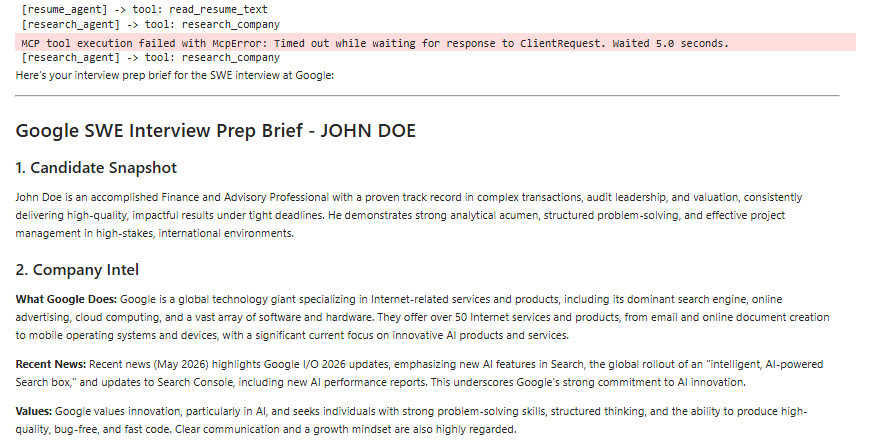
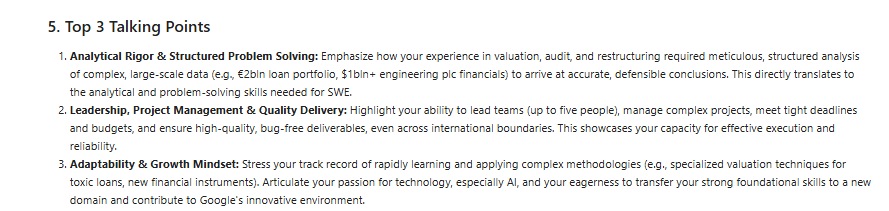

# Interview Prep Agent

A **multi-agent system** that turns a résumé (PDF) + a target job description into a tailored, research-backed **interview prep brief** — built with **Google ADK 2.0** and a custom **MCP server**.

> *Submission for the Google × Kaggle 5-Day AI Agents Intensive — Vibe Coding Capstone (June 2026).*

---

## Demo

**Agent tool trace + brief output (live run):**





---

## The problem

Interview prep is high-stakes and time-consuming. Candidates juggle three separate jobs at once: re-reading their own résumé to surface the right stories, researching the company's business and recent moves, and rehearsing structured (STAR) answers tailored to the role. Most people do this in scattered browser tabs the night before, and the result is generic.

This agent collapses that workflow into one run: give it your résumé and the job posting, and it produces a focused brief — company intel, the questions you're most likely to get, STAR answers grounded in *your actual experience*, and smart questions to ask back.

## Why agents (and not a single prompt)?

The task is genuinely multi-step and each step needs a different capability:

1. **Reading** a PDF and extracting structured facts (deterministic I/O).
2. **Researching** the company against the live web (an external tool call).
3. **Reasoning** over both to synthesize tailored answers (generation).

A single prompt can't reliably do live research or read a file. Splitting the work across cooperating agents — each with a narrow job and the right tool — produces a more accurate, inspectable result. Each agent's output becomes the next agent's input, so the final brief is grounded in real résumé facts *and* current company information rather than the model's stale memory.

## Architecture

```
User: résumé PDF + job description
            │
            ▼
┌─────────────────────────────────────────┐
│   SequentialAgent: interview_prep_pipeline │
│                                         │
│  resume_agent  ──► research_agent ──► brief_agent │
│  (LlmAgent)        (LlmAgent)        (LlmAgent)  │
└─────────────────────────────────────────┘
       │                  │                  │
  read_resume_text   research_company    (reasoning
  (ADK function      (MCP server tool)    only)
   tool, pypdf)            │
                           ▼
                  interview_mcp_server.py
                  (custom MCP server, stdio)
                           │
                           ▼
                  DuckDuckGo live web search
                           │
                           ▼
                     prep_brief.md
```

State flows between agents through ADK session state: each agent writes its result with `output_key`, and the next agent reads it via `{placeholder}` injection in its instruction.

| Agent | Job | Tool |
|-------|-----|------|
| `resume_agent` | Extract a structured candidate profile | `read_resume_text` (ADK function tool, pypdf) |
| `research_agent` | Live company + role research | `research_company` (**MCP server tool**) |
| `brief_agent` | Synthesize the final STAR-based brief | none (pure reasoning) |

The **MCP server** (`interview_mcp_server.py`) is a standalone Model Context Protocol server. The research agent acts as an MCP *client*: ADK launches the server as a subprocess over stdio, discovers its `research_company` tool, and proxies calls to it. This decouples the research capability from the agent — any MCP-compatible client could reuse the same server.

## Tech stack

- **Google ADK 2.0** (`google-adk`) — agent framework and orchestration (`SequentialAgent`, `LlmAgent`, `Runner`).
- **Gemini 2.5 Flash** — reasoning model behind each agent.
- **Model Context Protocol** (`mcp`) — custom stdio server exposing the research tool.
- **ddgs** — DuckDuckGo web search inside the MCP server.
- **pypdf** — résumé text extraction.

## Setup

**Requirements:** a Kaggle account (phone-verified) and a Google AI Studio API key.

1. Import `interview_prep_agent.ipynb` into Kaggle (**File → Import Notebook**).
2. In the notebook settings, turn **Internet ON**.
3. Add your Gemini key under **Add-ons → Secrets**, labelled exactly `GEMINI_API_KEY`.
4. Upload your résumé PDF via **+ Add Input → New Dataset**.
5. In Cell 2, set `TARGET_COMPANY`, `TARGET_ROLE`, and paste the job description.
6. **Run All.**

To run locally:

```bash
pip install google-adk google-genai mcp ddgs pypdf nest_asyncio
export GOOGLE_API_KEY="your_key"        # do NOT commit this
export GOOGLE_GENAI_USE_VERTEXAI=FALSE
jupyter notebook interview_prep_agent.ipynb
```

## Security

- **No secrets in code.** The Gemini key is read from Kaggle Secrets into `GOOGLE_API_KEY` at runtime — never hardcoded or committed.
- **Least-privilege tools.** `McpToolset(tool_filter=["research_company"])` ensures the model can only see and call the single intended tool.
- **Transient PII.** Résumé text is extracted in-memory and used only for the current run; nothing is persisted beyond the generated brief.
- **Isolated capability.** The web-research tool runs in a separate MCP server process, not in the agent's address space.

## Project journey

The first version was a single Gemini API script. It worked, but it was one monolithic prompt with no real agent structure. Rebuilding it on ADK forced a cleaner separation: each concern became its own agent with a single tool, and the web research became a proper MCP server any client could consume. The biggest design decision was making research an MCP tool rather than a local function — more moving parts, but the right abstraction: the same server could plug into Claude Desktop or a deployed agent unchanged.

## Files

- `interview_prep_agent.ipynb` — the full runnable agent (Kaggle notebook).
- `interview_mcp_server.py` — the standalone MCP research server.
- `README.md` — this file.
- `assets/` — screenshots from a live run.
